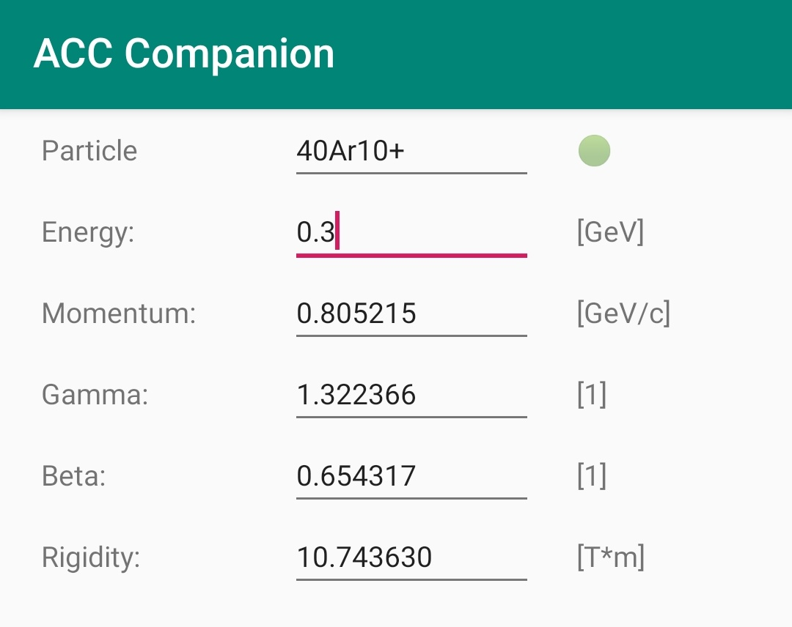

ACC Companion
=============

*Useful tools for accelerator physics*

*Can be compiled as Android or iOS app*

-----

   Compute equivalent beam parameters for any particle species.

How to build the app?
---------------------

This project has been created with `BeeWare <https://beeware.org/>`__. Please visit their website for more information on how to build the app.
